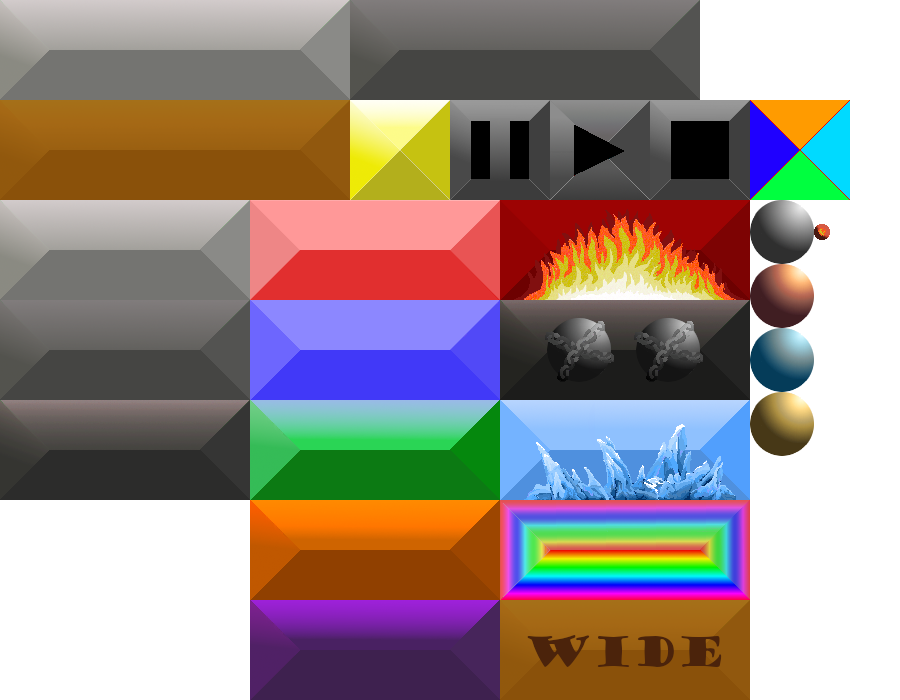

# Brick-Breaker
Brick breaker game, created in **Python 3.10.5**.

## Features
- 15 levels
- 5 powerups
- Highscore saving (not implemented)

## Code features
- Semi-responsive menu that can toggle level select display
- Multiple balls can be on the screen at once, and each ball's attributes are independent of the other balls. Powerups also affect balls' speed individually
- Multiple powerups can be active at the same time, even on the same ball (e.g. a smasher + fire ball)
- The trajectory of balls is controlled by where it bounces on the player paddle.
- The game handles double-collisions (i.e. when a ball collides with 2 bricks simultaneously at the border joining them), as well as edge collisions (when a ball hits the edge of a brick)
- Semi-responsive pause/resume button set-up
- The game resets after every run, so you can play multiple games without re-booting the app :)

## Notes on code logic

| Variable Type | Variable Name | Description | Related Functions |
| --- | --- | --- | --- |
| Global variables | `gameState` | Handles the overall game environment. <ul><li>1: game is running</li><li>2: game is paused</li><li>3: game is initialising</li><li>4: game is stopping (killing all entities)</li><li>1000: game is in main menu</li><li>1001: game is in level select menu</li><li>0: application is closing</li></ul> | `displayGameState()`: Renders the relevant sprite groups (buttons/game sprites) |
| | `player` | A `playerPaddle` object. | `.reset()`: Resets the paddle's position and size.   `.moveKeys()`: moves the paddle sprite in place.   `.widen()`: widens/un-widens the paddle. |
| | `currentLevel` | A `Level` object. | `.loadLevel()`: Loads in the specified level. The layout data is stored as a string of characters, which is read directly by the `brick` constructor.   `.updateHighScores()`: Updates high scores into the level datafile. |
| Sprite groups | `menuButtons`,   `gameStateButtons` | Sprite groups representing the two groups of buttons. `menuButtons` refers to the buttons visible at the menu; `gameStateButtons` refers to the pause, resume and stop buttons respectively. | `displayGameState()` |
| | `bricks`,   `walls`,   `balls`,   `game_entities` | Sprite groups representing the relevant objects in game. | `game_entities.draw(DISPLAY)` blits all in-game sprite objects onto the display. |
| Object classes | `Level` | An object that stores level data.   Level data is stored in **level.txt** as a configuration file. The file is formatted as such:   [levelName] `ballspeed, layout, highscores` | `ConfigParser().read()` reads from the file, while `ConfigParser().write()` writes into the file. |
| | `playerPaddle` | Represents the player's paddle in game.   `.wideState` indicates whether the brick is widened.   `.wideTime` increments until the **widen** powerup expires.| When a **widen** powerup is hit, `.widen()` is called. The `.wideTime` property increments until 600 (equivalent of 10 seconds), where the powerup expires. |
| | `brick` | An in-game brick.   `brick.typeID`: 1 to 5 for normal bricks;   'f' for firebrick;   'i' for icebrick;   'e' for extra balls;   's' for smasher brick;   'w' for widen powerup.   `brick.durability` | `.damage()` reduces the durability of the brick by 1, and returns True if it's killed. |
| | `wall` | A wall, forms the border of the screen. | |
| | `game_ball` | A single ball in the game.   `.x_coord, .y_coord` store the ball's coordinates as floats.   `.x_speed, .y_speed, .total_speed` store the ball's speeds.   `.x_dir, .y_dir` store the ball's directions.   `.heat_state, .heat_time` store the ball's fire/ice powerup states.   `.smasher_state, .smasher_time` store the ball's smasher powerup state. | **Ball movement**:   `update()` calls `.move_once()` as many times as the ball's speed, checking a list of conditions every movement: <ul><li>Collision between ball and playerPaddle. If yes, `.adjust_angle()` is called, and multiplier is reset.</li> <li>Wall bounces.</li> <li>Balls exiting the screen are killed.</li><li>Power-up effects are updated, and timers incremented.</li><li>Brick collisions (see below for detailed description).</li></ul> |

#### Sprite rendering

- `getImage()` uses the `pygame.transform.scale()` function to obtain a rectangle of pixels from *sprites.png* and transform it to the desired render size, returning the output image.
- `getImageCoords()` returns the appropriate 4-tuple representing the desired rectangle, depending on the value of the *imageType* input. (Note that some buttons have different sprites when selected/unselected, which is also implemented here.)
- `getImageSize()` returns the appropriate 2-tuple representing the desired render size, depending on the value of the *imageType* input.
- Finally, the output image is stored in `Sprite.image` and the `.get_rect()` function is called to return the image's display rectangle.

#### Brick collisions

- `update()` is called, iterating over all balls. Each ball is moved one unit at a time using `ball.move_once()`. A collision between a ball and a brick is detected.
- Firstly, if the ball's `.smasher_state` is True, then the adjacent bricks are also damaged. The function `brickAdjacency()` checks all other bricks to see if there are any adjacent bricks.
- Next, we check for adjacent bricks which were hit simultaneously, which leads to an edge case.
- Then, we call `ballCollideOnce()`, which checks for the edge case and updates the ball's directions accordingly.
- The function `ballEffect()` is then called, which increments score, multiplier, damages the brick, and triggers powerups. All powerups are implemented under this function. (The above two functions are implemented separately so that, in the edge case, the second brick can be damaged independently without unnecessarily updating the ball's new direction.)
- Finally, `ballEffect()` returns 1 if a brick is killed, which is passed by `ballCollideOnce()` to `update()`, halting the ball's per-unit movement and allowing us to move onto the next ball.
